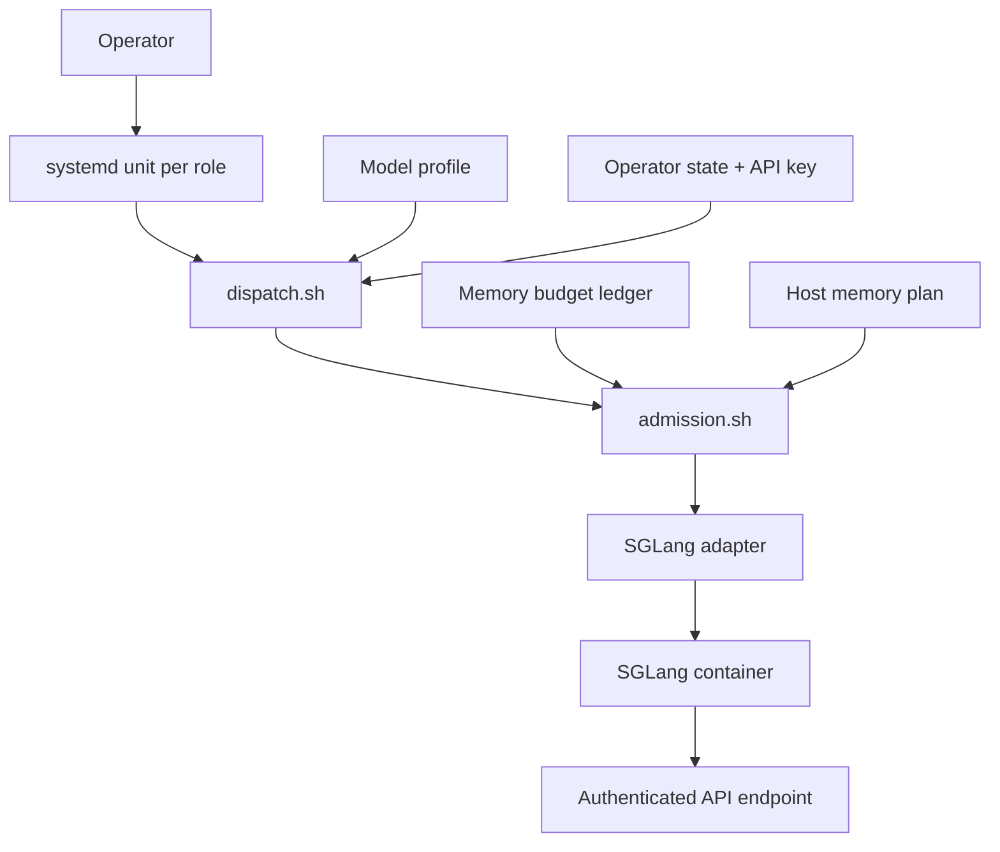
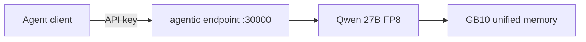
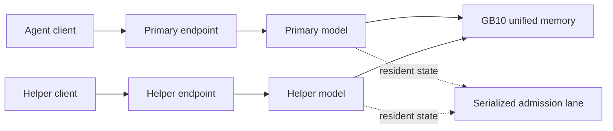
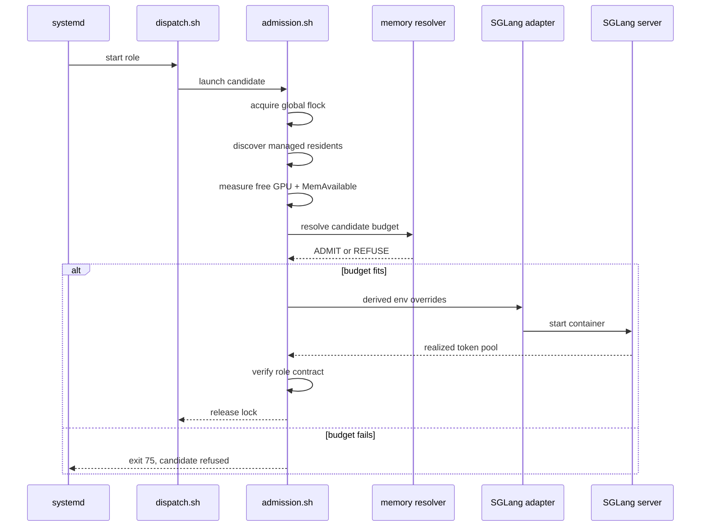
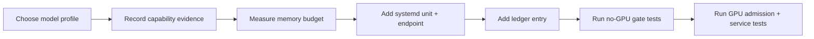

# dgx-spark-inference

> `dgx-spark-inference` runs a small set of authenticated SGLang services on one NVIDIA DGX Spark. It keeps runtime and model profiles pinned, binds models to named roles, and manages their endpoints with systemd.

Services can share the machine when their recorded memory budgets fit. Before each launch, the dispatcher measures available memory, derives SGLang’s static-memory setting, caps the KV pool, and checks host-memory headroom. When a role cannot meet its budget, that role is refused and services already running are left alone.

The intended topology is a fixed local setup: a few named roles, locally managed endpoints, and deliberate operator changes. The current work is grounded in a long-context primary model running alongside a smaller helper service.


## Tested environment

The measurements and behavior in this repo were validated on this configuration
(record the date you reproduce on your own):

| Component | Value |
|---|---|
| Hardware | NVIDIA DGX Spark (NVIDIA GB10, 121 GiB unified memory) |
| OS / kernel | Ubuntu 24.04.4 LTS · kernel `6.17.0-1021-nvidia` |
| GPU driver / CUDA | `580.159.03` / CUDA 13.0 |
| Container runtime | Docker with `--gpus all` |
| sglang runtime base image | `lmsysorg/sglang:v0.5.14-cu130-runtime` @ `sha256:9e436f44…0ad2` (see `runtime/sglang/Dockerfile`) |
| Served model | `Qwen/Qwen3.6-27B-FP8` @ revision `e89b16eb…6eb09` |
| Context / pool | 262144 context, 1 running / 1 queued, `mem-fraction-static=0.60` (measured → 346,485-token pool) |
| Measurements taken | 2026-06-29 (prep calibration + server-ready gates) |

## What's in the box

- One managed launch path per role: `systemd → dispatch.sh → admission.sh → sglang adapter`. Admission serializes launches, applies the memory budget for the candidate role, and verifies the realized KV-pool capacity after startup.
- **Reproducible profiles** that *describe* a model (HF repo + pinned revision +
  quantization + launch params). **No model weights are redistributed** — fetch
  them with `hf` (the Hugging Face CLI; documented per profile).
- **Explicit compatibility contracts**: capability records + a resolver that
  proves a candidate satisfies a role's requirements. Production safety comes
  from capability validation in the test suite **and** the runtime catalog only
  listing capability-compatible candidates.
- A **thin, safe installer** with a dry-run mode that refuses to clobber existing
  files unless you pass `--replace` (and even then, never touches operator state).
- A systemd unit, an operator CLI (`status` / `candidates` / `use` / `unload` /
  `reload`), and an **experimental** DFlash speculative-decoding path that is
  deliberately not a production candidate.


### Details

#### A small serving topology for one DGX Spark

This repo runs one or more pinned models on a single Spark, each with its own named role, its own authenticated endpoint, and its own systemd lifecycle. When you want more than one model resident at a time, a shared admission lane makes sure they don't trip over each other reaching for the same pool of unified memory.

---

### The pieces



Every role gets its own unit, its own endpoint, its own profile, and its own lifecycle. The one thing they share is the admission path — that's what serializes launches so two roles never try to allocate from the same memory pool at the same instant.

---

### Reference baseline

Out of the box, the repo is set up to run one role like this:

| Piece                | Reference configuration                     |
| --------------------- | -------------------------------------------- |
| Role                  | `agentic`                                    |
| Profile               | `qwen36-27b-fp8`                             |
| Model                 | `Qwen/Qwen3.6-27B-FP8` at a pinned revision   |
| Context contract      | 262,144 tokens                               |
| Baseline concurrency  | 1 running request, 1 queued request          |
| Endpoint              | Authenticated local service on port `30000`  |
| Unit                  | `inference-agentic.service`                  |

The profile is where model identity, revision, quantization, and launch parameters all live. We don't ship weights in this repo — your host pulls them into its own Hugging Face cache the first time the role starts.

---

### Running a single role



If you just want one model running, this is all you need — the role starts up using the launch settings already recorded in its profile. Without a memory-planner pair installed, it falls back to whatever `mem_fraction_static` the profile has recorded, no extra setup required.

---

### Running two roles side by side



A primary model and a helper model can share the Spark, as long as their measured memory budgets actually fit together. Each new role you add needs its own profile, unit, endpoint, secret path, and ledger entry — the memory planner doesn't create any of that for you, it just decides whether a candidate is admitted once everything else is in place.

---

### What happens at launch



Every launch takes a global lock before it measures anything, and holds it through planning, launch, and verification. A second role can't sneak in on a stale free-memory reading while the first role is still mid-allocation.

---

### The two SGLang memory knobs

```text
mem_fraction_static = static_required / A_preload
max_total_tokens    = role-specific KV-pool ceiling
```

`mem_fraction_static` gets derived fresh from whatever GPU memory is free right before launch. `max_total_tokens` caps the KV pool at each role's configured ceiling, even if there's plenty of free memory when the process starts. Between the two, every role lands on a stable static-memory footprint no matter what order things came up in.

---

### The measured budget ledger

```toml
[profiles.primary]
weights_gib                    = <measured>
target_pool_tokens             = <measured>
minimum_admissible_pool_tokens = 262144
kv_bytes_per_token             = <measured>
static_overhead_gib            = <measured>
cuda_graph_peak_gib            = <measured>
request_workspace_gib          = <measured>

[profiles.helper]
weights_gib                    = <measured>
target_pool_tokens             = <measured>
minimum_admissible_pool_tokens = <role requirement>
kv_bytes_per_token             = <measured>
static_overhead_gib            = <measured>
cuda_graph_peak_gib            = <measured>
request_workspace_gib          = <measured>
```

Rather than keeping a separate budget for every possible combination of resident roles, the ledger just records measured numbers per profile. Add a role, add one profile entry — the admission logic figures out the rest at launch time.

---

### What can happen when you start a role

| Situation                                        | Result                                                 |
| -------------------------------------------------- | -------------------------------------------------------- |
| Ledger and plan present; both gates pass          | Candidate starts and its realized pool is verified     |
| Candidate would breach GPU or host-memory budget  | Candidate role is refused                               |
| Candidate starts but realizes too few KV tokens   | Candidate is stopped and refused                         |
| Existing co-resident is healthy                   | It keeps running, untouched                              |
| Only one of the two planner files exists          | Refusal — planner state is treated as incomplete         |
| No planner pair, mode is `auto`                   | Launch proceeds on the profile alone, no memory admission |
| No planner pair, mode is `required`                | Candidate role is refused                                |

If a role can't meet its contract, it gets refused on the spot — and refusing one role never means restarting or killing whatever else is already healthy and running.

---

### Turning memory admission on

```text
$CONFIG_ROOT/
├── memory_ledger.toml
└── memory_plan.toml
```

```ini
# systemd unit environment
DGX_MEMORY_PREFLIGHT=required
```

These two files come as a pair — they describe the same host and the same measured budgets, so they only make sense together. Setting `DGX_MEMORY_PREFLIGHT=required` is what makes the planner a hard requirement for a role to launch at all.

---

### Adding a new role



To promote a new role, you'll want:

1. A pinned model profile.
2. Evidence the model can actually do the work you're giving it.
3. A measured memory budget.
4. Its own unit, endpoint, secret path, and port.
5. An update to the memory plan for the host topology.
6. Confirmation on the Spark that it admits cleanly and realizes its expected pool.

For a single role, none of this is required. But it matters once you're running more than one.

## Install the service

This is a **reference blueprint to tailor locally**, not a clone-and-deploy
image. The one piece that is inherently host-specific is the **runtime image ID
pin**: the adapter refuses to launch any container whose image ID doesn't match
the committed pin in `runtime/sglang/runtime-manifest.toml`, and a fresh
`docker build` of the Dockerfile produces a *different* ID than the committed
one. So you must build and re-pin **before** install. `scripts/build-runtime.sh`
does both.

The phases below are short on commands but not on wall-clock: a 27B cold load is
~4 minutes, and the gated weight fetch is ~30 GB. See `docs/runbook.md` for
operating the service after install.

### 1. Prepare

```bash
# 1a. Build the runtime image and pin its ID into the manifest (REQUIRED first).
#     This rewrites runtime/sglang/runtime-manifest.toml:image_id to YOUR build.
scripts/build-runtime.sh --update

# 1b. Fetch the baseline weights into your model cache (one-time, ~30 GB).
#     Qwen3.6-27B-FP8 is gated: accept the license on the repo page, then `hf auth login`.
export MODEL_CACHE_ROOT=/srv/model-cache
export HF_HOME="$MODEL_CACHE_ROOT"
hf download Qwen/Qwen3.6-27B-FP8 \
  --revision e89b16ebf1988b3d6befa7de50abc2d76f26eb09

# 1c. Create your secret (operator-supplied; never handled by this repo).
install -d -m 0700 ~/.config/dgx-spark-inference
echo "SGLANG_API_KEY=$(openssl rand -hex 32)" > ~/.config/dgx-spark-inference/agent.env
chmod 600 ~/.config/dgx-spark-inference/agent.env
```

### 2. Install

```bash
# 2a. Preview the install (renders the unit + config plan; writes nothing).
deploy/install.sh --dry-run \
  --model-cache-root "$MODEL_CACHE_ROOT" \
  --agent-env ~/.config/dgx-spark-inference/agent.env

# 2b. Install (refuses to clobber existing files unless --replace; never starts the service).
deploy/install.sh \
  --model-cache-root "$MODEL_CACHE_ROOT" \
  --agent-env ~/.config/dgx-spark-inference/agent.env
```

### 3. Activate

```bash
# 3a. Start it (cold load ~4 min for 27B; `systemctl start` returns immediately,
#     readiness is when /health returns 200 — poll, don't trust the fast return).
sudo systemctl start dgx-spark-inference.service

# 3b. Verify (read-only smoke gate — full version in docs/smoke-test.md).
curl -s http://127.0.0.1:30000/health   # 200 = ready
```

## Where to read next

- [`docs/handbook.md`](docs/handbook.md) — what this provides (entry point).
- [`docs/architecture.md`](docs/architecture.md) — the binding system, request
  flow, and the honest role of the resolver.
- [`docs/operations.md`](docs/operations.md) — status/candidates/use/lifecycle/health.
- [`docs/runbook.md`](docs/runbook.md) — day-2 operations: diagnostics, rollback, upgrades.
- [`docs/security.md`](docs/security.md) — the LAN-only firewall prerequisite.
- [`docs/known-limitations.md`](docs/known-limitations.md) — GB10/DFlash/memory limits.
- [`docs/smoke-test.md`](docs/smoke-test.md) — the release gate.

## License

Apache-2.0. See [`LICENSE`](LICENSE).
