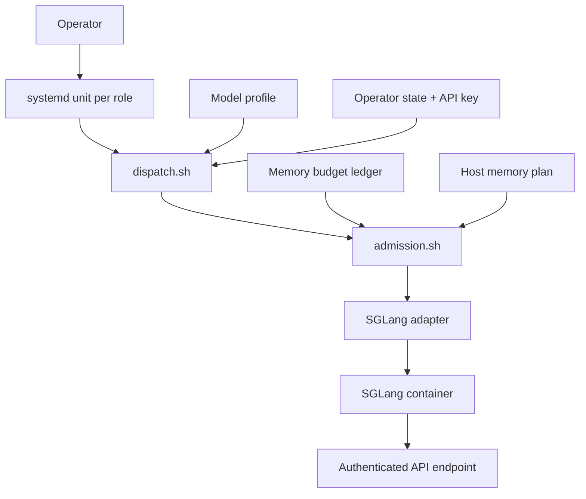
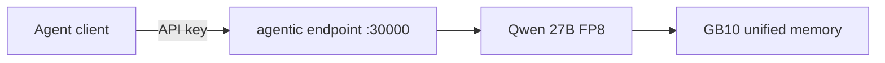
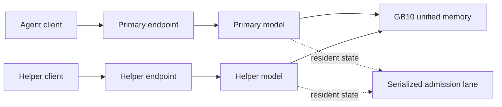
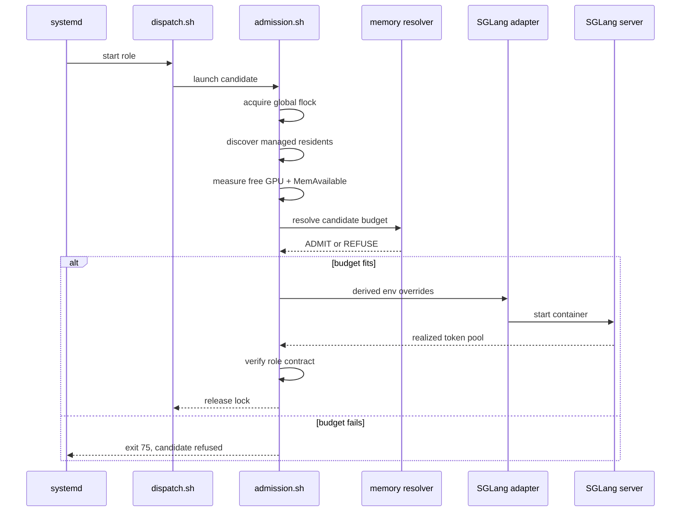

# dgx-spark-inference

> `dgx-spark-inference` runs a small set of authenticated SGLang services on one NVIDIA DGX Spark. It keeps runtime and model profiles pinned, binds models to named roles, and manages their endpoints with systemd.

Services can share the machine when their recorded memory budgets fit. Before each launch, the dispatcher measures available memory, derives SGLang’s static-memory setting, caps the KV pool, and checks host-memory headroom. When a role cannot meet its budget, that role is refused and services already running are left alone.

The intended topology is a fixed local setup: a few named roles, locally managed endpoints, and deliberate operator changes. The current work is grounded in a long-context primary model running alongside a smaller helper service.


## Tested environment

The measurements and behavior in this repo were validated on this configuration
(record the date you reproduce on your own):

| Component | Value |
|---|---|
| Hardware | NVIDIA DGX Spark (NVIDIA GB10, 121 GiB unified memory) |
| OS / kernel | Ubuntu 24.04.4 LTS · kernel `6.17.0-1021-nvidia` |
| GPU driver / CUDA | `580.159.03` / CUDA 13.0 |
| Container runtime | Docker with `--gpus all` |
| sglang runtime base image | `lmsysorg/sglang:v0.5.14-cu130-runtime` @ `sha256:9e436f44…0ad2` (see `runtime/sglang/Dockerfile`) |
| Served model | `Qwen/Qwen3.6-27B-FP8` @ revision `e89b16eb…6eb09` |
| Context / pool | 262144 context, 1 running / 1 queued, `mem-fraction-static=0.60` (measured → 346,485-token pool) |
| Measurements taken | 2026-06-29 (prep calibration + server-ready gates) |

## What's in the box

- One managed launch path per role: `systemd → dispatch.sh → admission.sh → sglang adapter`. Admission serializes launches, applies the memory budget for the candidate role, and verifies the realized KV-pool capacity after startup.
- **Reproducible profiles** that *describe* a model (HF repo + pinned revision +
  quantization + launch params). **No model weights are redistributed** — fetch
  them with `hf` (the Hugging Face CLI; documented per profile).
- **Explicit compatibility contracts**: capability records + a resolver that
  proves a candidate satisfies a role's requirements. Production safety comes
  from capability validation in the test suite **and** the runtime catalog only
  listing capability-compatible candidates.
- A **thin, safe installer** with a dry-run mode that refuses to clobber existing
  files unless you pass `--replace` (and even then, never touches operator state).
- A systemd unit, an operator CLI (`status` / `candidates` / `use` / `unload` /
  `reload`), and an **experimental** DFlash speculative-decoding path that is
  deliberately not a production candidate.


### Details

#### A small serving topology for one DGX Spark

This repo runs one or more pinned models on a single Spark, each with its own named role, its own authenticated endpoint, and its own systemd lifecycle. When you want more than one model resident at a time, a shared admission lane makes sure they don't trip over each other reaching for the same pool of unified memory.

---

### The pieces



Every role gets its own unit, its own endpoint, its own profile, and its own lifecycle. The one thing they share is the admission path — that's what serializes launches so two roles never try to allocate from the same memory pool at the same instant.

---

### Reference baseline

Out of the box, the repo is set up to run one role like this:

| Piece                | Reference configuration                     |
| --------------------- | -------------------------------------------- |
| Role                  | `agentic`                                    |
| Profile               | `qwen36-27b-fp8`                             |
| Model                 | `Qwen/Qwen3.6-27B-FP8` at a pinned revision   |
| Context contract      | 262,144 tokens                               |
| Baseline concurrency  | 1 running request, 1 queued request          |
| Endpoint              | Authenticated local service on port `30000`  |
| Unit                  | `dgx-spark-inference.service`                  |

The profile is where model identity, revision, quantization, and launch parameters all live. We don't ship weights in this repo — your host pulls them into its own Hugging Face cache the first time the role starts.

---

### Running a single role



If you just want one model running, this is all you need — the role starts up using the launch settings already recorded in its profile. Without a memory-planner pair installed, it falls back to whatever `mem_fraction_static` the profile has recorded, no extra setup required.

---

### Running two roles side by side



A primary model and a helper model can share the Spark, as long as their measured memory budgets actually fit together. Each new role you add needs its own profile, unit, endpoint, secret path, and ledger entry — the memory planner doesn't create any of that for you, it just decides whether a candidate is admitted once everything else is in place.

---

### What happens at launch



Every launch takes a global lock before it measures anything, and holds it through planning, launch, and verification. A second role can't sneak in on a stale free-memory reading while the first role is still mid-allocation.

---

### The two SGLang memory knobs

```text
mem_fraction_static = static_required / fraction_base
max_total_tokens    = role-specific KV-pool ceiling
```

`max_total_tokens` caps the KV pool at each role's configured ceiling, even if more memory is free when the process starts.

`mem_fraction_static` is derived at launch from the profile's measured static requirement and the `fraction_base` recorded in that profile's ledger entry:

* `a_preload` means the available GPU memory at the model's load moment.
* `device_total` means the full device memory.

`a_preload` is the normal default. `device_total` is a runtime-path calibration: it may be used only when the profile was measured with that same base and repeated validation shows that SGLang applies `mem_fraction_static` against device total for that path.

The measurement tool records `fraction_base` in the emitted ledger entry. Do not hand-swap it later: a budget measured against one base must be resolved against that same base.

Together, the derived fraction and `max_total_tokens` make a role's static allocation and KV-pool ceiling deliberate rather than dependent on startup order.

---

### The measured budget ledger

```toml
[[profiles]]
model_id = "primary"

[profiles.budget]
weights_gib =
target_kv_tokens =
minimum_admissible_pool_tokens =
kv_bytes_per_token =
static_pad_gib =
static_overhead_gib =
cuda_graph_peak_gib =
request_workspace_gib =
gpu_headroom_gib =
fraction_base = "a_preload"
```

The ledger records one measured budget per model profile. Repeat the `[[profiles]]` entry for each profile that is eligible for planner admission.

`fraction_base` is part of that measured budget. It records whether the measurement used `a_preload` or `device_total` as the denominator for `mem_fraction_static`.

---

### What can happen when you start a role

| Situation                                        | Result                                                 |
| -------------------------------------------------- | -------------------------------------------------------- |
| Ledger and plan present; both gates pass          | Candidate starts and its realized pool is verified     |
| Candidate would breach GPU or host-memory budget  | Candidate role is refused                               |
| Candidate starts but realizes too few KV tokens   | Candidate is stopped and refused                         |
| Existing co-resident is healthy                   | It keeps running, untouched                              |
| Only one of the two planner files exists          | Refusal — planner state is treated as incomplete         |
| No planner pair, mode is `auto`                   | Launch proceeds on the profile alone, no memory admission |
| No planner pair, mode is `required`                | Candidate role is refused                                |

If a role can't meet its contract, it gets refused on the spot — and refusing one role never means restarting or killing whatever else is already healthy and running.

---

### Turning memory admission on

```text
$CONFIG_ROOT/
├── memory_ledger.toml
└── memory_plan.toml
```

```ini
# systemd unit environment
DGX_MEMORY_PREFLIGHT=required
```

These two files come as a pair — they describe the same host and the same measured budgets, so they only make sense together. Setting `DGX_MEMORY_PREFLIGHT=required` is what makes the planner a hard requirement for a role to launch at all.

---

### Adding a new role

```mermaid
flowchart LR
    R[Define role contract] --> P[Choose candidate model profile]
    P --> E[Record capability evidence]
    E --> V[Prove candidate satisfies role]
    V --> B[Measure memory budget]
    B --> U[Add systemd unit + endpoint]
    U --> L[Add ledger entry + host memory plan]
    L --> T[Run no-GPU gate tests]
    T --> G[Run GPU admission + service tests]
```



To add another role to an existing deployment, you need:

1. **A role contract.** Define the role’s name, required capabilities, and residency policy. This answers what work the role is allowed to perform, independently of any particular model.

2. **A pinned candidate model profile.** Record the model identity, revision, quantization, and launch settings.

3. **Evidence that the candidate satisfies the role contract.** Measure and record the capabilities the model actually provides, then prove that they cover every capability required by the role. Add the candidate to the runtime catalog only after that proof passes.

4. **A measured memory budget.** Record the model’s weights, static overhead, request workspace, and admissible KV-pool range on the target hardware.

5. **Its own service surface.** Add a unit, endpoint, secret path, port, and container name for the new role.

6. **A host topology update.** Add the profile to the memory ledger and declare the intended resident and admissible roles in the host memory plan.

7. **Live verification on the Spark.** Confirm that the new role admits cleanly beside the existing service, realizes its expected KV pool, and refuses safely without disturbing healthy residents when the topology cannot fit.

The shipped single-role `agentic` setup already has a role contract, pinned profile, compatible catalog entry, unit, endpoint, and baseline launch settings. It does not need a co-residency memory plan.

Adding `agentic-helper` changes two things at once: it introduces a new semantic contract for a second role, and it introduces a shared-memory deployment topology. Both must be declared and verified.

---

### Worked example: adding the Ornith-9B helper

This walkthrough promotes a second, explicit role beside the Qwen primary: a smaller `agentic-helper` served by hydrated `Ornith-1.0-9B-FP8-DYNAMIC`.

A role name is not a capability contract. `agentic-helper` means nothing to the resolver, catalog, or client until its requirements are written down. In this example, the helper is intended for tool-using, multi-turn agent work that may need reasoning and grammar-constrained structured output. Its role contract therefore requires all five capabilities:

* `chat_completion`
* `reasoning`
* `tool_calling`
* `multiturn_continuity`
* `structured_output`

The promotion sequence is deliberate:

```text
role contract
  → measured model capability record
  → resolver proof
  → runtime catalog entry
  → systemd endpoint
  → memory-admission plan
  → live health and pool verification
```

Do not reverse that order. A profile saying “helper” does not establish what a helper is allowed to do.

The checked-in installer is still single-role: it ships one `agentic` unit and does not create a second role’s policy, profile, catalog entry, or unit. Treat the version-controlled role policy, capability record, catalog entry, and tests as project changes. Treat the unit, secrets, and memory-plan files as host-specific operator state.

#### 1. Verify the primary before changing anything

```bash
INFCTL=/usr/local/lib/dgx-spark-inference/src/inferencectl/inference-cli.sh

sudo CONFIG_ROOT=/etc/dgx-spark-inference "$INFCTL" status

curl -s -o /dev/null -w "primary /health = %{http_code}\n" \
  http://127.0.0.1:30000/health
# expected: 200
```

The existing primary must be healthy before the helper is introduced. The helper promotion must not become a repair session for an already-unhealthy primary.

#### 2. Build the complete hydrated Ornith artifact

The FP8 derivative omits processor files required by Ornith’s conditional multimodal wrapper, even for text-only serving. Build one complete local artifact and record exactly what it contains. Do not source missing files dynamically at launch.

```bash
BUNDLE="$MODEL_CACHE_ROOT/ornith-1.0-9b-fp8"

hf download barryke/Ornith-1.0-9B-FP8-DYNAMIC \
  --local-dir "$BUNDLE"

hf download deepreinforce-ai/Ornith-1.0-9B \
  --include preprocessor_config.json video_preprocessor_config.json \
  --local-dir /tmp/ornith-bf16-base

cp /tmp/ornith-bf16-base/{preprocessor_config,video_preprocessor_config}.json \
  "$BUNDLE/"

(
  cd "$BUNDLE"
  sha256sum * | tee HYDRATION_MANIFEST.md
)
```

The resulting local directory is the artifact the profile describes. Record the FP8 source revision, the BF16 source revision for the copied files, and the hydration manifest in that profile’s provenance.

#### 3. Define `agentic-helper` before choosing it

Extend the project role policy in `config/examples/roles.toml`. This file is the source of truth for what a role requires. Keep the existing primary contract and add the helper explicitly.

```toml
# config/examples/roles.toml

requested_roles = ["agentic", "agentic-helper"]

[roles.agentic]
required_model_capabilities = [
  "chat_completion",
  "tool_calling",
  "structured_output",
]

[roles.agentic.residency]
default_up = true
idle_timeout_sec = 900
idle_floor_sec = 300
idle_behavior = "stay_up"

# This role is not shorthand for “a small model.”
# It is a tool-using, multi-turn helper with a measured reasoning and
# grammar-constrained-output requirement.
[roles.agentic-helper]
required_model_capabilities = [
  "chat_completion",
  "reasoning",
  "tool_calling",
  "multiturn_continuity",
  "structured_output",
]

[roles.agentic-helper.residency]
# Keep first promotion operator-controlled. Enable automatic startup only
# after the two-role deployment has passed its live verification.
default_up = false
idle_timeout_sec = 900
idle_floor_sec = 300
idle_behavior = "stay_up"
```

This makes the distinction concrete:

* `agentic` is the primary role’s current minimum contract.
* `agentic-helper` is a separate role with its own purpose and stricter declared requirements.
* The helper cannot be cataloged merely because Ornith launches or emits plausible chat text.

#### 4. Create Ornith’s capability record

Create `profiles/ornith-1.0-9b-fp8/capability.toml` beside the helper’s SGLang launch profile.

The ordinary identity and provenance fields must name the hydrated artifact you actually built. The role-relevant portion must be exactly this:

```toml
kind = "model-capability"
capability_id = "ornith-1.0-9b-fp8-agentic-helper"
promotion_state = "approved"
approval_scope = "spark-coresident-reference-v0.2"

model_id = "ornith-1.0-9b-fp8"
source_repository = "barryke/Ornith-1.0-9B-FP8-DYNAMIC"
source_revision = "<pinned FP8 revision>"
quantization = "fp8"

# This candidate offers itself only for the role it was measured to fill.
roles = ["agentic-helper"]

capabilities = [
  "chat_completion",
  "reasoning",
  "tool_calling",
  "multiturn_continuity",
  "structured_output",
]

compatible_runtime_ids = [
  "sglang-v0.5.14-cu130-runtime-distro1.9.0",
]

launch_profile = "ornith-1.0-9b-fp8-agentic-helper"
```

Do not copy this approval state to another Ornith revision, quantization, runtime image, parser configuration, or hydration recipe without re-running the gates.

For this particular candidate, the evidence must cover:

1. Chat completion with reasoning separated from visible content.
2. Tool-call parsing using the configured tool-call parser.
3. Multi-turn continuity through a tool result.
4. Grammar-constrained structured output, not prompt-only JSON.
5. The reasoning-token budget needed for constrained requests.

The observed structured-output condition is operationally important: the helper may consume hundreds of tokens in reasoning before emitting its constrained answer. Document a client minimum such as `max_tokens >= 600` for constrained requests, based on the measured result.

#### 5. Prove the role resolves before offering it to the runtime

The resolver is a consistency gate, not a launch-time gate. Run it before editing `available.toml` or starting a helper service.

Because the resolver expects directories containing only capability records, stage the two model records and the runtime record into temporary directories:

```bash
MODEL_CAPS="$(mktemp -d)"
RUNTIME_CAPS="$(mktemp -d)"

cp profiles/qwen36-27b-fp8/capability.toml \
  "$MODEL_CAPS/qwen36-27b-fp8.toml"

cp profiles/ornith-1.0-9b-fp8/capability.toml \
  "$MODEL_CAPS/ornith-1.0-9b-fp8.toml"

cp runtime/sglang/capability.toml \
  "$RUNTIME_CAPS/sglang.toml"

python3 tools/resolve_service_plan.py \
  --request config/examples/roles.toml \
  --models-dir "$MODEL_CAPS" \
  --runtimes-dir "$RUNTIME_CAPS"
```

The command must exit successfully and report both `agentic` and `agentic-helper` as resolved.

Also add a repository test that fails if Ornith no longer resolves for `agentic-helper`, and extend the catalog-compatibility test so adding an incompatible candidate later cannot silently bypass the role contract.

A resolver failure is a stop sign. Fix the role definition, capability record, evidence, or runtime compatibility. Do not continue by weakening the catalog.

#### 6. Offer only the proven candidate in the runtime catalog

After the resolver and tests pass, append the helper slot to `runtime/sglang/available.toml`:

```toml
[roles.agentic-helper]
default = "ornith-1.0-9b-fp8"
served_model_name = "agentic-helper"

[[roles.agentic-helper.models]]
id = "ornith-1.0-9b-fp8"
kind = "model"
spec = "profiles/ornith-1.0-9b-fp8/sglang.toml"
```

This catalog entry does not define the role’s requirements. It only says that this already-proven candidate is available to fill that role.

The stable served name belongs to the role slot, not the underlying model. Future compatible helper swaps preserve the API name `agentic-helper`.

#### 7. Add the second systemd service and endpoint

Create `/etc/systemd/system/inference-agentic-helper.service` by copying the shipped agentic unit and changing the role-specific values:

```text
ROLE=agentic-helper
PORT=30001
CONTAINER_NAME=inference-agentic-helper
DGX_MEMORY_PREFLIGHT=required
```

Keep the helper’s API key path distinct from the primary if the two roles have different clients or trust boundaries. The helper must not reuse a throwaway probe container, port, or probe-only secret.

Reload the unit definitions after creating the helper unit:

```bash
sudo systemctl daemon-reload
```

#### 8. Add the helper to the memory-admission topology

Install the ledger and plan as a matched pair:

```bash
sudo cp tools/memory_planner/budget_ledger.toml \
  /etc/dgx-spark-inference/memory_ledger.toml
```

Write `/etc/dgx-spark-inference/memory_plan.toml` for this host’s intended residency. It must include the primary as a resident and the helper as an admissible role:

```toml
[[resident]]
role = "agentic"
model_id = "qwen36-27b-fp8"

[[admit]]
role = "agentic-helper"
model_id = "ornith-1.0-9b-fp8"
```

Use the measured helper budget and host floor for this machine. Do not transplant a static `mem_fraction_static` from an earlier probe. Admission derives the fraction from current free memory and caps the pool with `max_total_tokens`.

#### 9. Start, verify, and inspect the helper

```bash
sudo systemctl start inference-agentic-helper.service

curl -s -o /dev/null -w "helper /health = %{http_code}\n" \
  http://127.0.0.1:30001/health

curl -s -o /dev/null -w "primary /health = %{http_code}\n" \
  http://127.0.0.1:30000/health

sudo journalctl -u inference-agentic-helper.service -n 40 --no-pager
```

The helper is ready only when its `/health` endpoint returns `200`. A fast return from `systemctl start` is not readiness.

Then confirm that the authenticated server reports a token pool within the helper’s declared admissible range:

```bash
KEY="$(
  sudo awk -F= '
    $1 == "SGLANG_API_KEY" {
      print $2
      exit
    }
  ' /etc/dgx-spark-inference/agent.env
)"

curl -s \
  -H "Authorization: Bearer $KEY" \
  http://127.0.0.1:30001/get_server_info \
  | jq '.max_total_num_tokens'
```

Finally, perform a deliberate refusal test by setting the host-memory floor above the available co-resident headroom, restarting only the helper, and confirming:

* the helper exits with admission refusal,
* the primary remains healthy on port `30000`,
* restoring the real plan allows the helper to start again.

That final refusal test is part of promoting the role. A two-service setup is not complete merely because both models happened to coexist once.


## Install the service

This is a **reference blueprint to tailor locally**, not a clone-and-deploy
image. The one piece that is inherently host-specific is the **runtime image ID
pin**: the adapter refuses to launch any container whose image ID doesn't match
the committed pin in `runtime/sglang/runtime-manifest.toml`, and a fresh
`docker build` of the Dockerfile produces a *different* ID than the committed
one. So you must build and re-pin **before** install. `scripts/build-runtime.sh`
does both.

The phases below are short on commands but not on wall-clock: a 27B cold load is
~4 minutes, and the gated weight fetch is ~30 GB. See `docs/runbook.md` for
operating the service after install.

### 1. Prepare

```bash
# 1a. Build the runtime image and pin its ID into the manifest (REQUIRED first).
#     This rewrites runtime/sglang/runtime-manifest.toml:image_id to YOUR build.
scripts/build-runtime.sh --update

# 1b. Fetch the baseline weights into your model cache (one-time, ~30 GB).
#     Qwen3.6-27B-FP8 is gated: accept the license on the repo page, then `hf auth login`.
export MODEL_CACHE_ROOT=/srv/model-cache
export HF_HOME="$MODEL_CACHE_ROOT"
hf download Qwen/Qwen3.6-27B-FP8 \
  --revision e89b16ebf1988b3d6befa7de50abc2d76f26eb09

# 1c. Create your secret (operator-supplied; never handled by this repo).
install -d -m 0700 ~/.config/dgx-spark-inference
echo "SGLANG_API_KEY=$(openssl rand -hex 32)" > ~/.config/dgx-spark-inference/agent.env
chmod 600 ~/.config/dgx-spark-inference/agent.env
```

### 2. Install

```bash
# 2a. Preview the install (renders the unit + config plan; writes nothing).
deploy/install.sh --dry-run \
  --model-cache-root "$MODEL_CACHE_ROOT" \
  --agent-env ~/.config/dgx-spark-inference/agent.env

# 2b. Install (refuses to clobber existing files unless --replace; never starts the service).
deploy/install.sh \
  --model-cache-root "$MODEL_CACHE_ROOT" \
  --agent-env ~/.config/dgx-spark-inference/agent.env
```

### 3. Activate

```bash
# 3a. Start it (cold load ~4 min for 27B; `systemctl start` returns immediately,
#     readiness is when /health returns 200 — poll, don't trust the fast return).
sudo systemctl start dgx-spark-inference.service

# 3b. Verify (read-only smoke gate — full version in docs/smoke-test.md).
curl -s http://127.0.0.1:30000/health   # 200 = ready
```

## Where to read next

- [`docs/handbook.md`](docs/handbook.md) — what this provides (entry point).
- [`docs/architecture.md`](docs/architecture.md) — the binding system, request
  flow, and the honest role of the resolver.
- [`docs/operations.md`](docs/operations.md) — status/candidates/use/lifecycle/health.
- [`docs/runbook.md`](docs/runbook.md) — day-2 operations: diagnostics, rollback, upgrades.
- [`docs/measure-model-budget.md`](docs/measure-model-budget.md) — measuring a model budget and enrolling it in planner admission.
- [`docs/security.md`](docs/security.md) — the LAN-only firewall prerequisite.
- [`docs/known-limitations.md`](docs/known-limitations.md) — GB10/DFlash/memory limits.
- [`docs/smoke-test.md`](docs/smoke-test.md) — the release gate.

## License

Apache-2.0. See [`LICENSE`](LICENSE).
